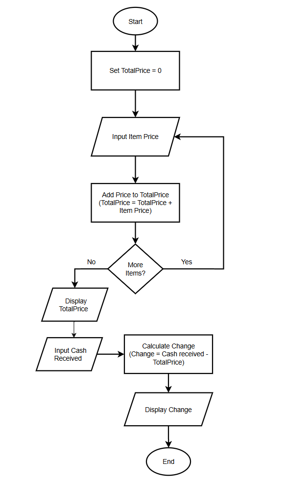

 Annex A: Computational Thinking Exercise
"Smart School Canteen Queue"

Section: IX Potassium  
Score: ____________  
C# / Name:  
 Noreen Ysabelle C. Angangan  
 LaVyrly D. Lucero  
 Princess Sofia Roda  
Date: August 21, 2026  

---

 Scenario
The PSHS school canteen is small and often gets crowded during lunch break. Students line up to buy food, but the process is slow because:
 Some students take too long to decide what to order.
 The cashier has to manually calculate totals and give change.
 There is no system to track which food items are running out.

Your group’s task is to decompose this problem into smaller, manageable parts that could be solved with computational thinking (CT) Skills.

---

 Step 1: Identify the Big Problem

Main Problem:  
The PSHS school canteen suffers from severe overcrowding and slow queue processing during lunch break due to delayed student ordering decisions, manual cashier total and change calculations, and the lack of a real-time inventory tracking system.

---

 Step 2: Identify three to four Sub-Problems

Please list possible sub-problems:
1. Order Decision Delays: Students take too long to decide what food to order while standing directly at the cashier counter.
2. Payment and Transaction Delays: Cashiers manually calculate transaction totals and handle cash change, slowing down line velocity.
3. Absence of Inventory Tracking: Canteen staff lack a system to monitor remaining stock in real time, leading to unexpected stockouts at the counter.
4. Queue & Pickup Congestion: Order placement, payment processing, and meal collection occur in one unstructured, crowded area.

---

 Step 3: Define Computational Thinking Approaches

| Sub-Problem                | CT Skill Applied        | Example Solution                                      
|----------------------------|-------------------------|----------------------------------------------------------- |                            |                         |
| 1. Order Decision Delays   | Abstraction             | Show only necessary information on a simple menu board    |                            |                         | outside the canteen.    
--------------------------------------------------------------------------------------------------------------------
| 2. Slow Payment Processing | Algorithm Design        | Create a basic step-by-step calculator program to sum     |                            |                         |    order totals and calculate change. 
--------------------------------------------------------------------------------------------------------------------
| 3. Lack of Stock Tracking  | Pattern Recognition     | Track popular items and use a quick tally board to        |                            |                         |  mark items "SOLD OUT".          
--------------------------------------------------------------------------------------------------------------------
| 4. Queue Congestion        | Decomposition           | Separate the single crowding area into two clear           |                            |                         |  lines: one for paying and one for pickup.          
-------------------------------------------------------------------------------------------------------------------

 Step 4: Algorithmic Solution for Identified Sub-Problem

