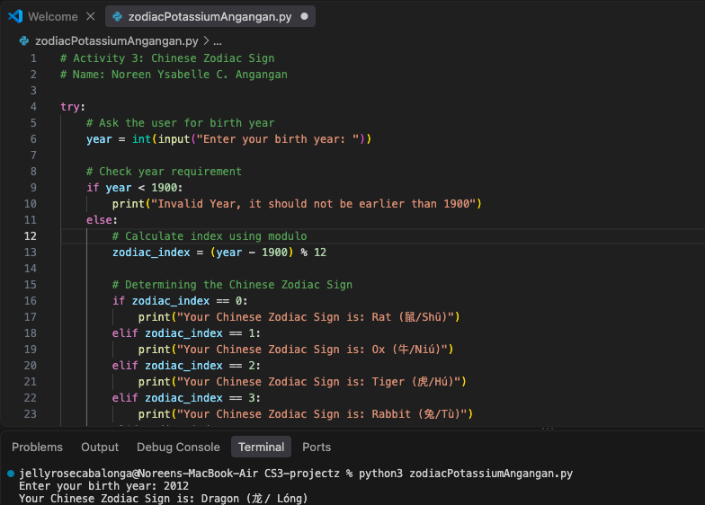
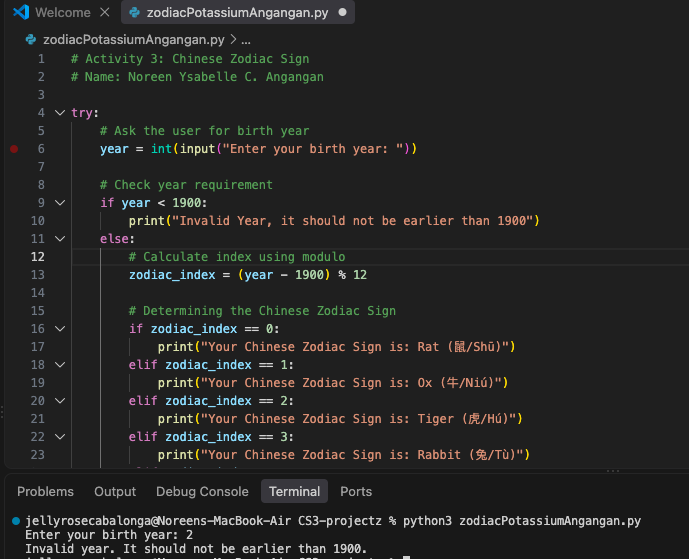
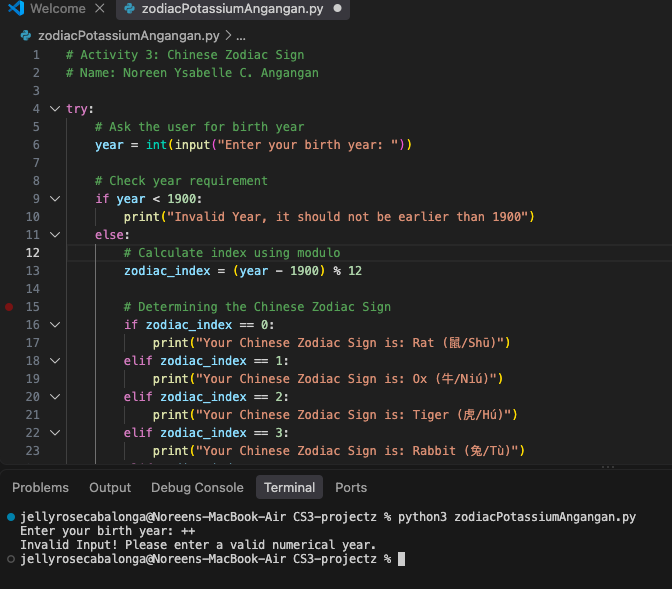

# Activity 3: Implementing Selection Structure - Chinese Zodiac Sign

**Student Name:** Noreen Ysabelle C. Angangan  
**Date:** August 22, 2026  

---

## 1. Activity Instructions & Requirements

This code requirement focuses on the implementation of the basics of Python based on the learning resource given.

### Instructions:
1. Create a `zodiacSectionLN.py` file. This file will contain your solutions to the requirements below:

   a. Ask the user to enter a year of birth. The baseline year is 1900.
   
   b. Validate user input that it should not be earlier than 1900.
   
   c. If the user enters an invalid year then display an appropriate message then stop or abort the program.
     
      * Example:  
      
        `Enter your birth year: 1800`  
        
        `Invalid Year, it should not be earlier than 1900`
        
   d. Otherwise determine the Chinese zodiac sign based on the following starting from 1900. 
   
    Note: A zodiac sign will recur after each 12 years:
   
      * i. Rat (鼠/Shū)
      * ii. Ox (牛/Niú)
      * iii. Tiger (虎/Hú)
      * iv. Rabbit (兔/Tù)
      * v. Dragon (龙/ Lóng)
      * vi. Snake (蛇/Shé)
      * vii. Horse (马/Mǎ)
      * viii. Goat (羊/ Yáng)
      * ix. Monkey (猴/Hóu)
      * x. Rooster (鸡/Jī)
      * xi. Dog (狗/Gǒu)
      * xii. Pig (豬/Zhū)
      
   e. CONSIDER only the year of birth.
   
   * Example input and output:  
     `Enter your birth year: 2000`  
     `Your Chinese Zodiac Sign is: Dragon (龙/ Lóng)`

2. Test and Run your code before submitting.
3. Document this graded exercise in your Github portfolio and save it in `zodiacSectionLN.md`. This `.md` will include the requirements for this coding exercise, your actual code and a screenshot of your output. Update also your `README.md` file to have the link to your files.
4. Commit your changes in your github account and submit the live code link to your teacher and also your git repository link.
5. Refer to Annex D for Code Exercise Rubrics for Grading.

---

## 2. Annex D: Coding Exercise Rubrics for Grading

<p><strong>Total Points: 22/20</strong> (includes bonus points)</p>

<table>
  <thead>
    <tr>
      <th>Criteria</th>
      <th>Description</th>
      <th>Points</th>
    </tr>
  </thead>
  <tbody>
    <tr>
      <td><strong>1. Code Functionality / Correctness</strong></td>
      <td>
        The program runs correctly, produces expected results, and meets the requirements of the exercise. Partial credit if mostly correct but with minor errors. Partial credit also if answered using the "brute force" method.<br><br>
        <em>Breakdown:</em>
        <ul>
          <li>The use of input and output statement (2 pts)</li>
          <li>Input validation using a selection structure and showing appropriate message (2 pts)</li>
          <li>The use of selection structure to determine the Chinese zodiac sign and displaying the correct output (4 pts)</li>
          <li>The use of correct math and conditional operations (2 pts)</li>
        </ul>
      </td>
      <td><strong>10 pts</strong></td>
    </tr>
    <tr>
      <td><strong>2. Code Efficiency & Logic</strong></td>
      <td>Code uses appropriate structures (loops, conditionals, variables) without unnecessary repetition. Solutions are logical and efficient.</td>
      <td><strong>3 pts</strong></td>
    </tr>
    <tr>
      <td><strong>3. Good Coding Practices</strong></td>
      <td>Proper indentation, meaningful variable names, comments explaining key parts, and consistent formatting. Encourages readability, maintainability and testability.</td>
      <td><strong>3 pts</strong></td>
    </tr>
    <tr>
      <td><strong>4. Debugging & Error Handling</strong></td>
      <td>The student identifies and fixes errors, uses simple error-handling techniques (if applicable), and demonstrates resilience in troubleshooting.</td>
      <td><strong>2 pts</strong></td>
    </tr>
    <tr>
      <td><strong>5. Portfolio Update & Documentation</strong></td>
      <td>Final output is saved, documented, and added to the student's coding portfolio that contains complete requirements for documentation.</td>
      <td><strong>2 pts</strong></td>
    </tr>
    <tr>
      <td><strong>6. Creativity & Problem-Solving (Bonus)</strong></td>
      <td>The student shows initiative by adding small enhancements (e.g., extra features, alternative approaches) or demonstrates originality in solving the problem - out of the box solution.</td>
      <td><strong>2 pts</strong></td>
    </tr>
  </tbody>
</table>

---

## 3. Source Code (`zodiacSectionLN.py`)

```python
# Activity 3: Chinese Zodiac Sign
# Name: Noreen Ysabelle C. Angangan

try:
    # Ask the user for birth year
    year = int(input("Enter your birth year: "))

    # Check year requirement
    if year < 1900:
        print("Invalid Year, it should not be earlier than 1900")
    else:
        # Calculate index using modulo
        zodiac_index = (year - 1900) % 12

        # Determining the Chinese Zodiac Sign 
        if zodiac_index == 0:
            print("Your Chinese Zodiac Sign is: Rat (鼠/Shū)")
        elif zodiac_index == 1:
            print("Your Chinese Zodiac Sign is: Ox (牛/Niú)")
        elif zodiac_index == 2:
            print("Your Chinese Zodiac Sign is: Tiger (虎/Hú)")
        elif zodiac_index == 3:
            print("Your Chinese Zodiac Sign is: Rabbit (兔/Tù)")
        elif zodiac_index == 4:
            print("Your Chinese Zodiac Sign is: Dragon (龙/ Lóng)")
        elif zodiac_index == 5:
            print("Your Chinese Zodiac Sign is: Snake (蛇/Shé)")
        elif zodiac_index == 6:
            print("Your Chinese Zodiac Sign is: Horse (马/Mǎ)")
        elif zodiac_index == 7:
            print("Your Chinese Zodiac Sign is: Goat (羊/ Yáng)")
        elif zodiac_index == 8:
            print("Your Chinese Zodiac Sign is: Monkey (猴/Hóu)")
        elif zodiac_index == 9:
            print("Your Chinese Zodiac Sign is: Rooster (鸡/Jī)")
        elif zodiac_index == 10:
            print("Your Chinese Zodiac Sign is: Dog (狗/Gǒu)")
        elif zodiac_index == 11:
            print("Your Chinese Zodiac Sign is: Pig (豬/Zhū)")

except ValueError:
    # Check for non-number inputs 
    print("Invalid Input! Please enter a valid numerical year.")
```


---

## 4. Program Output Screenshots

### Case 1: Valid Birth Year


### Case 2: Invalid Year (< 1900)


### Case 3: Non-Numerical Input

